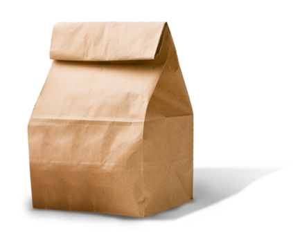

# BEYOND Brown Bag Sessions

---

# Agenda

|                                         |
| --------------------------------------- |
| Motivation                              |
| CoP Comparison                          |
| Format                                  |
| Outcome                                 |
| Proposed Roadmap                        |
| Invitation                              |

------------------

# Motivation
> A Brown Bag Session is a training or learning session during an extended lunch break.

We want to stay smart and informed about the modern technology landscape
and accumulate a toolbox of useful _Techniques_, _Tools_, _Platforms_, _Languages & Frameworks_
in the spirit of the ThoughtWorks [Technology Radar](https://www.thoughtworks.com/de/radar).

------------------

# CoP Comparison

## Community of Practice

- bi-weekly schedule
- sharing knowledge of actual BEYOND findings
- directly applicable to our daily business

## Brown Bag Session

- monthly schedule
- topics not necessarily related to current BEYOND tech
- findings could lead to negative assessment (_hold_)

------------------

# Format

- Meet once per month, Friday 12:00 - 14:00
- Topic defined by agenda upfront
- conference room with projector
- Limited number of voluntary participants
- [Mob programming](https://en.wikipedia.org/wiki/Mob_programming)
  * or parallel pair programming exercises
- Bring Your Own Lunch
  * or order pizza

------------------

# Outcome

- knowledge gained by all participants
- technology assessment (e.g. _adopt_, _trial_, _assess_, _hold_)
- documented learnings (e.g. Confluence)
- boosted communication channels
- team building effects
- employee motivation ;-)

------------------

# Proposed Roadmap

| Date       | Quadrant    | Topic                |
| ---------- | ----------- | -------------------- |
| 2017-06-23 | Language    | Kotlin               |
| 2017-07-xx | Language    | Scala                |
| 2017-08-xx | Language    | Frege/Clojure/Groovy |
| 2017-09-xx | Techniques  | Tech Radar 09/2017   |
| 2017-10-xx | Frameworks  | jOOQ                 |

------------------

# Invitation

## First Brown Bag Session

- Date: 2017-06-23 12:00 - 14:00
- Location: tbd
- Topic: Replace Java with Kotlin for _ng-tax_

## Expected learnings:

- good fit of language constructs?
- how to build?
- how to test?
- how to operate (K8S, logging, monitoring)?

## Wanna join?

