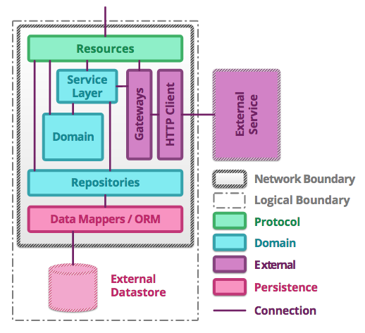

# Service virtualization in acceptance stage

---

# Agenda

|                                         |
| --------------------------------------- |
| Motivation                              |
| Scope                                   |
| Terminology                             |
| Short term plan                         |
| Long term plan                          |

------------------

# Motivation
- Temporary outage of the 3rd party blocks delivery of non related services
- CDP Failures requires time for investigation
- Number of 3rd party integration is growing

------------------

# Scope of discussion
- Mailgun
- Intercom

------------------

# Terminology
## Service stub
> minimal implementation of an interface that normally returns hardcoded data

## Service mock
> can be flexible, both tightly and loosely coupled to the test suite data

## Virtual service
>  service virtualization involves creating and deploying a "virtual asset" that simulates the behavior of a real component which is required to exercise the application under test, but is difficult or impossible to access for development and testing purposes

------------------

# Service structure

# Short term plan
- Replace Mailgun and Intercom with mocks of corresponding type in Acceptance stage

# Long term plan
- Move verification of 3rd party integration to Pre-Prod

------------------

# Resources
- https://en.wikipedia.org/wiki/Service_virtualization
- https://martinfowler.com/articles/microservice-testing/
- https://www.infoq.com/articles/stubbing-mocking-service-virtualization-differences
- https://epages.atlassian.net/wiki/display/TB/Using+mocks+of+third-party+services
