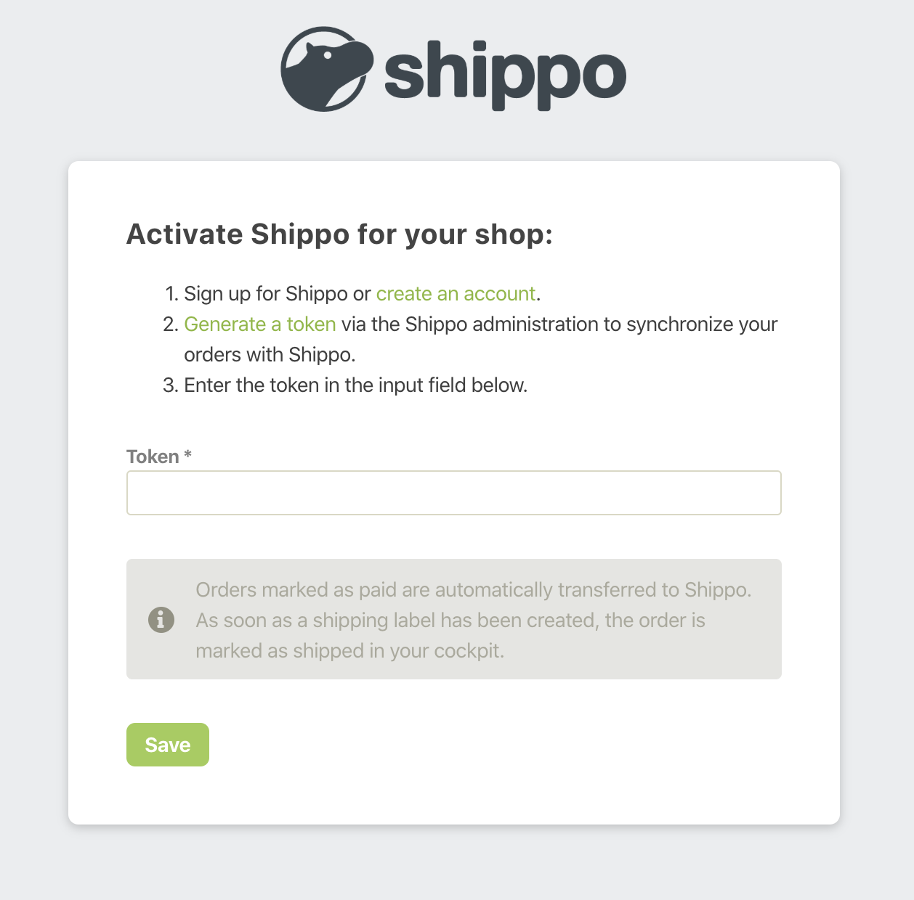

### Review #46

_"Leftovers"_

---

<!-- .slide: data-background="./img/team42-logo.png" data-background-size="1300px" -->

## Agenda

|                        |
| ---------------------- |
| ePages Devportal       |
| Beyond Canvas          |
| Shippo Connector App   |
| Krypton                |
| CSV Import App         |
| Beyond Api Ruby Client |
| Misc. tasks            |
| Next Steps             |

---

## GitHub Statistics

<div class="container">
  <canvas id="chart"></canvas>
</div>

---

<!-- .slide: data-background="./img/team42-logo.png" data-background-size="1300px" -->

# ePages Devportal

---

## Create sitemap.xml

<section>

[](https://developer.epages.com/sitemap.xml)

</section>

---

## Add anchors to sidebar elements

<section>

### Why?

To be able to reference to a specific endpoint

</section>

<section>

[](https://developer.epages.com/beyond-docs/#create_a_jsonwebtoken_from_refresh_token)

</section>

---

## Identify required cookies

<section>

### Why?

To collect the necessary information for the cookie advice

</section>

---

<!-- .slide: data-background="./img/team42-logo.png" data-background-size="1300px" -->

# Beyond Canvas

---

## Add gem installer

<section>

### What?

It's a Rails command that generates:

* the general configuration file (e.g. to set up the company logo)
* some Rails utils

</section>

<section>

```bash
$ rails generate beyond_canvas:install
```

</section>

---

## Add custom style generator

<section>

### What?

Beyond Canvas comes with _out-of-the-box_ styles to make your app look like as a Beyond integrated one. But you can also customize them with a generator

</section>

<section>

```bash
$ rails generate beyond_canvas:custom_styles
```

</section>

---

## Other tasks

<section>

* Fix `.slim` files breaking the gem
* Fix requiting to create the `_head.html.*` on the project instead of using the gem's one

</section>

---

<!-- .slide: data-background="./img/team42-logo.png" data-background-size="1300px" -->

# Shippo Connector App

---

## Enhance Sign up page

<section>

* Add keys for registration steps
* Add information message

</section>

<section>



</section>

---

<!-- .slide: data-background="./img/team42-logo.png" data-background-size="1300px" -->

# Krypton

---

## Display scopes on app detail page

<section>

[](https://admin.beyondshop.cloud/official_apps/8d7650f7-40ce-41a1-88c5-47d21d7bbab5/edit)

</section>

---

## Allow a user to manage multiple resellers

<section>

[](https://staging.admin.beyondshop.cloud/users/ed5d7130-c85c-425d-9518-1025c1d5bba0/edit)

</section>

---

## Other tasks

<section>

* Create a rake task to remove features/apps from shops

</section>

---

<!-- .slide: data-background="./img/team42-logo.png" data-background-size="1300px" -->

# CSV Import App

---

## Create product validation page

<section>

[](https://epages.atlassian.net/wiki/x/IIASU?atlOrigin=eyJwIjoiYyIsImkiOiI1NDgyNzczRkUxMzU0QzQ0OEVDQzVGNjNGQTNDMjExQiJ9)

</section>

---

<!-- .slide: data-background="./img/team42-logo.png" data-background-size="1300px" -->

# Beyond API Ruby Client

---

## Automatically upload gem documentation to Rubydoc

<section>

[](https://rubydoc.info/github/ePages-de/beyond_api-ruby_client)

</section>

---

## Other tasks

<section>

* Add new endpoints
* Remove depredated endpoints
* Update outdated yard documentation

</section>

---

<!-- .slide: data-background="./img/team42-logo.png" data-background-size="1300px" -->

# Misc. tasks

---

## Configure all projects

<section>

### VSCode

* Default editor configuration
* Recommended extensions
* VSCode tasks
* Debugger configuration

</section>

<section>

### Linters

* ESLint
* SassLint

</section>

<section>

#### Others

* Run ESLint and SassLint on pre-commit

</section>

---

## Other tasks

<section>

* Remove obsolete scopes from existing apps
* Move team's slides to reveal-md (markdown)

</section>

---

<!-- .slide: data-background="./img/team42-logo.png" data-background-size="1300px" -->

# Questions?

---

<!-- .slide: data-background="./img/team42-logo.png" data-background-size="1300px" -->

# Next Steps

---

## Next Steps

|                                                            |
| ---------------------------------------------------------- |
| Refactor CSV Import app                                    |
| Display app data from feature-definitions call in app list |

---

<!-- .slide: data-background="./img/team42-logo.png" data-background-size="1300px" -->

# Thank you!


